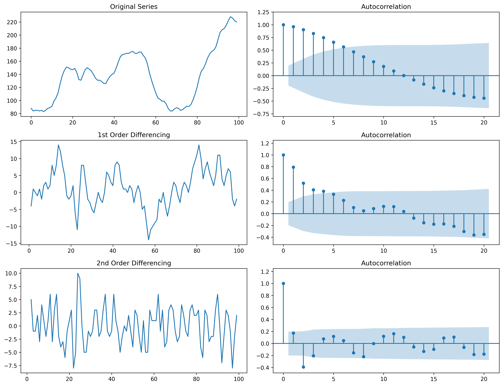
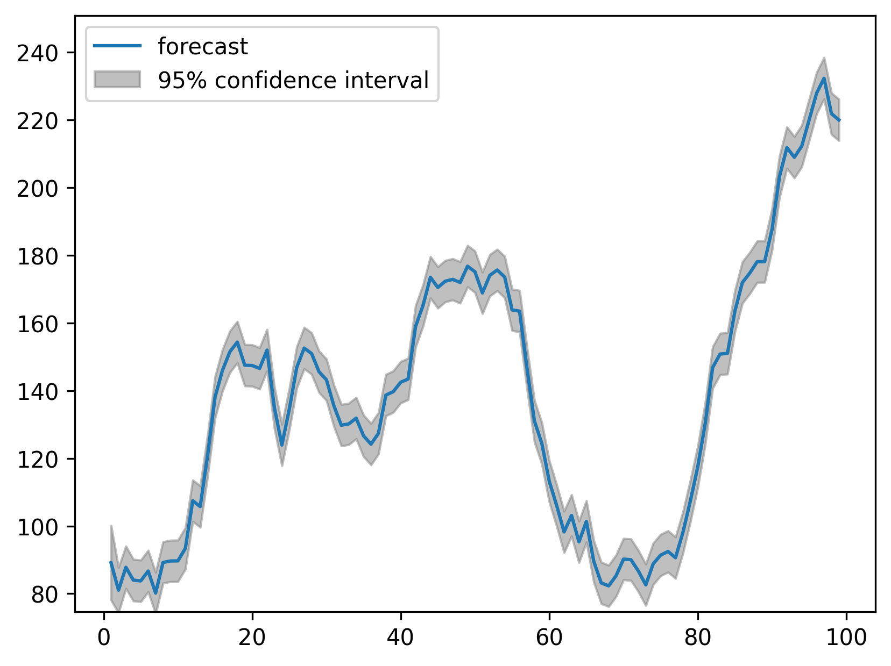
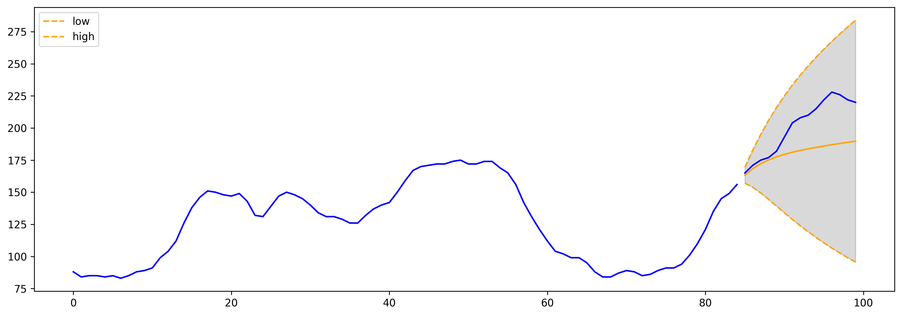

# ARIMA Time Series Forecasting

This project demonstrates the use of the **ARIMA (AutoRegressive Integrated Moving Average)** model for time series forecasting. It walks through the end-to-end process of preparing univariate time series data, checking for stationarity, tuning model parameters, and evaluating prediction performance.

---

## What I Learned

### Stationarity
In time series modeling, **stationarity** is a critical assumption—meaning the statistical properties (like mean and variance) do not change over time. I tested for stationarity using:

- **Rolling statistics:** Visual inspection of mean and standard deviation over time
- **Augmented Dickey-Fuller (ADF) test:** A formal hypothesis test where a low p-value (< 0.05) indicates stationarity

When needed, I applied **differencing** to the data to achieve stationarity, which is the "I" (Integrated) part of ARIMA.

---

### Autocorrelation & Model Selection
I examined the **Autocorrelation Function (ACF)** and **Partial Autocorrelation Function (PACF)** plots to determine the appropriate `p` and `q` parameters for AR (AutoRegressive) and MA (Moving Average) terms.

- **ACF:** Helps identify the MA order `q`
- **PACF:** Helps identify the AR order `p`

These plots help quantify the correlation between the time series and its lagged values.

 *ACF and PACF Plot*

  

---

### ARIMA Modeling
After transforming the data and identifying parameters, I trained the ARIMA model with selected `(p, d, q)` values. The steps included:

- Fitting the model on the training set
- Forecasting future points
- Comparing predictions with the actual values to evaluate performance

 *Model Fit and Forecast*

  

---

### Out-of-Sample Forecasting
To assess real-world performance, I evaluated the model on an **out-of-sample test set** (data not seen during training). This tests the model’s ability to generalize to unseen data and is crucial for validating a forecasting model.

 *Out-of-Sample Forecast*

  

---

## Workflow Summary

1. Load and visualize the time series data
2. Test for stationarity and difference the data if necessary
3. Examine ACF and PACF to choose `p` and `q`
4. Fit the ARIMA model with the best parameters
5. Forecast future values and compare with actuals
6. Evaluate in-sample and out-of-sample accuracy

---

## 🛠️ Tech Stack

- `pandas` & `numpy` – data manipulation
- `statsmodels` – ARIMA modeling, ADF test
- `matplotlib` – data visualization

---

## Getting Started

1. Run `arima.ipynb` in Jupyter or VS Code

---

## 📄 License

This project is licensed under the MIT License.

